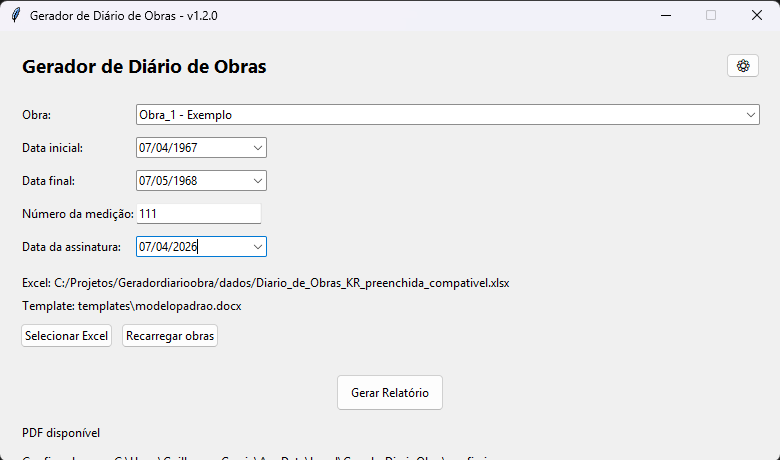

# 🏗️ Gerador de Diário de Obras

Automação de geração de diários de obra a partir de dados coletados via Microsoft Forms + Excel.

---

## 🚀 Problema

Na construção civil, o preenchimento manual de diários de obra é:
- demorado
- sujeito a erros
- difícil de padronizar

---

## 💡 Solução

Este projeto automatiza todo o processo:

📊 Forms → Excel  
⚙️ Processamento em Python  
📄 Geração automática de relatórios Word/PDF  

---

## ✨ Funcionalidades

- Interface gráfica simples (Tkinter)
- Leitura automática do Excel
- Filtro por obra e período
- Tratamento de duplicidade de registros
- Consolidação de tarefas e mão de obra
- Geração automática de documentos `.docx`
- Exportação para PDF (via Word)

---

## 🧠 Como funciona

1. Dados são coletados via Forms
2. Exportados para Excel
3. O sistema:
   - filtra registros
   - agrupa por data
   - consolida informações
4. Gera relatórios padronizados automaticamente

---

## 🛠️ Tecnologias

- Python
- Tkinter (interface)
- OpenPyXL (leitura Excel)
- DocxTpl (geração Word)

---

## 📸 Interface



---

## ▶️ Como rodar

```bash
pip install -r requirements.txt
python app.py
